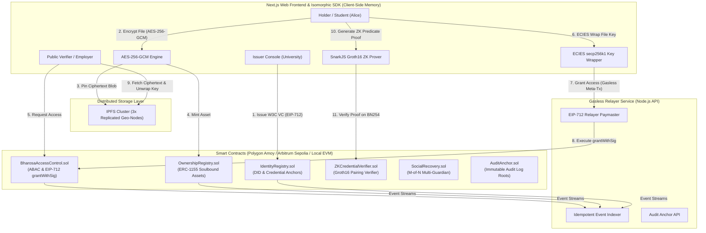

# BHAROSA (भरोसा)
### Decentralized Verifiable Identity, Encrypted Asset Custody & Zero-Knowledge Credential Platform
**Smart India Hackathon 2026** · **Problem Statement:** SIH26125 · **Team:** LUMINARYFORGE

---

[-84CC16.svg)](#smart-contracts)
[](#zero-knowledge-module)
[](#isomorphic-typescript-sdk)
[](#api--indexing-service)
[](#design-system)
[](#standards--compliance)

---

## 1. Executive Summary & Problem Statement

**Problem Statement SIH26125:** Traditional academic, government, and corporate credential verification systems are plagued by credential forgery, costly manual verification delays, non-consensual data sharing, and single-point-of-failure centralized databases. When students or citizens submit academic transcripts or identity documents for job applications or regulatory checks, they are forced to expose excessive private data (full scorecards, dates of birth, Aadhaar numbers) without access expiry or cryptographic revocation.

**The Solution — BHAROSA (भरोसा):**
BHAROSA is a production-grade, zero-knowledge, gasless Web3 platform built to deliver sovereign identity and privacy-preserving asset management:
- **W3C DID & Verifiable Credentials:** Self-custodied DIDs (`did:ethr:...`) and W3C VCs anchored immutably via canonical EIP-712 structured data hashes on EVM smart contracts.
- **Client-Side Encrypted Asset Vault:** Browser AES-256-GCM symmetric encryption with ECIES (secp256k1) key delegation and IPFS cluster pinning. Zero plaintext ever leaves client memory.
- **Attribute-Based Access Control (ABAC):** NIST SP 800-162 access engine enforcing time-bound access windows (`notBefore`, `expiresAt`), purpose binding, and instant smart-contract-level revocation.
- **Zero-Knowledge Qualification Verification:** Circom 2 + SnarkJS Groth16 zk-SNARKs enabling students to prove qualification predicates (e.g. `CGPA >= 7.50` or `Age >= 18`) on-chain with zero disclosure of actual raw marks or sensitive attributes.
- **Gasless Meta-Transactions:** EIP-712 sponsored execution through a relayer paymaster, eliminating native gas token hurdles for end users.
- **M-of-N Multi-Guardian Social Recovery:** Safeguard self-custody with guardian consensus and safety timelocks, preventing permanent asset or identity loss.
- **Auditing & Admin Governance:** Complete ISO 27560:2023 digital consent receipts, DPDP Act 2023 compliance, real-time security alerts, and system telemetry dashboard.

---

## 2. Architecture & System Flow



---

## 3. The 10-Step Hero Flow Demo

BHAROSA features a 100% automated end-to-end integration test (`packages/sdk/test/hero-flow.e2e.test.ts`) covering the complete platform lifecycle:

| Step | Action | Actor | Technical Mechanism |
| :---: | :--- | :---: | :--- |
| **1** | Register Self-Custodied DID | Student | Generates `did:ethr:31337:0x7099...` with W3C DID document. |
| **2** | Issue Verifiable Degree | University | EIP-712 signed W3C VC anchored on `IdentityRegistry.sol`. |
| **3** | Encrypt & Pin Research Paper | Student | In-browser AES-256-GCM + random IV, ciphertext pinned to IPFS. |
| **4** | Request Verification Access | Company | ABAC access request with purpose and 24h duration. |
| **5** | ECIES Key Delegation | Student | Encapsulates AES key to Company secp256k1 public key via ECDH + HKDF. |
| **6** | Verify & Decrypt | Company | Verifies VC signature, unwraps key, decrypts ciphertext, validates SHA-256 integrity match. |
| **7** | Early Revocation | Student | Instant on-chain revocation on `BharosaAccessControl.sol`. |
| **8** | Revocation Invariant Check | System | Verifier decryption blocked immediately (`REVOKED` invariant enforced). |
| **9** | Zero-Knowledge Qualification | Student | Groth16 ZK proof proving `CGPA >= 7.50` without disclosing `9.40` score. |
| **10** | Immutable Audit Chaining | Platform | Cryptographic SHA-256 Merkle root anchored across all 10 state transitions. |

---

## 4. Monorepo Structure

```
bharosa/
├── apps/
│   ├── web/                     # Next.js 14 App Router Frontend (White + Lime Green)
│   │   ├── app/
│   │   │   ├── page.tsx         # Interactive Platform Dashboard & Metric Shell
│   │   │   ├── issuer/          # University Issuer Console (Single & CSV Bulk Issue)
│   │   │   ├── credentials/     # Holder Verifiable Credential Wallet & QR Share
│   │   │   ├── public-verify/   # Zero-Login 5-Point Public Verification Portal
│   │   │   ├── assets/          # AES-256-GCM Encrypted Asset Vault & Stepper
│   │   │   ├── access/          # ABAC Access Delegation & ISO 27560 Consent Receipts
│   │   │   ├── zk/              # Groth16 Zero-Knowledge Predicate Verification
│   │   │   ├── security/        # Multi-Guardian Social Recovery & Quick-Lock Center
│   │   │   ├── admin/           # Admin Governance, Whitelisting & Circuit Breaker
│   │   │   └── audit/           # Immutable Audit Trail & CSV/JSON Export
│   │   └── components/          # Reusable UI Components (Header, Nav, Modal, Stepper)
│   └── api/                     # Express.js Backend Helper & Security Indexer
│       ├── src/
│       │   ├── routes/          # SIWE Auth, Audit, Health, Relayer, IPFS Health
│       │   ├── workers/         # Event Indexer & IPFS Cluster Pinning Monitor
│       │   └── lib/             # Resilient In-Memory Fallback Stores & Redis Cache
├── packages/
│   ├── contracts/               # Hardhat EVM Smart Contracts (Solidity ^0.8.24)
│   │   ├── contracts/
│   │   │   ├── IdentityRegistry.sol
│   │   │   ├── BharosaAccessControl.sol
│   │   │   ├── OwnershipRegistry.sol
│   │   │   ├── SocialRecovery.sol
│   │   │   ├── AuditAnchor.sol
│   │   │   └── ZKCredentialVerifier.sol
│   │   └── test/                # Hardhat Test Suite (43 Unit & Integration Tests)
│   ├── circuits/                # Circom 2.1.6 zk-SNARK Circuit Definitions
│   │   ├── credential_predicate.circom # Groth16 Predicate Comparator + Poseidon Hasher
│   │   └── scripts/             # SnarkJS Trusted Setup & Solidity Verifier Generator
│   └── sdk/                     # Isomorphic TypeScript SDK (28 Tests Passing)
│       ├── src/
│       │   ├── crypto/          # AES-256-GCM, ECIES secp256k1, HKDF-SHA256
│       │   ├── did/             # W3C DID Document & EIP-712 Verifiable Credentials
│       │   ├── ipfs/            # Multi-Node IPFS Cluster Client
│       │   └── zk/              # SnarkJS Prover & Verification Bindings
│       └── test/
│           └── hero-flow.e2e.test.ts # 10-Step Automated E2E Verification Suite
└── docs/
    └── DECISIONS.md             # 18 Architecture Decision Records (ADRs)
```

---

## 5. Smart Contracts Overview

All contracts are deployed with Hardhat targeting `evmVersion: "cancun"` with OpenZeppelin Contracts v5:

| Contract | Purpose | Key Standards / Features |
| :--- | :--- | :--- |
| `IdentityRegistry.sol` | Root DID registry & credential anchor ledger | W3C DID, EIP-712, on-chain canonical hash anchor & revocation. |
| `BharosaAccessControl.sol` | Attribute-Based Access Control & time windows | NIST SP 800-162, EIP-712 `grantWithSig` gasless meta-tx. |
| `OwnershipRegistry.sol` | Sovereign digital asset custody & soulbound minting | ERC-1155, Soulbound credentials, emergency circuit breaker. |
| `SocialRecovery.sol` | M-of-N multi-guardian identity recovery | Timelocked recovery execution, rogue attack cancellation. |
| `AuditAnchor.sol` | Merkle root anchoring for verifiable audit trails | Single & batch root anchoring with block timestamp indexing. |
| `ZKCredentialVerifier.sol` | Groth16 zero-knowledge proof verification | BN254 elliptic curve pairing check, issuer authorization check. |

---

## 6. Developer Quickstart

### Prerequisites
- Node.js `>= 18.20.0`
- `pnpm` `>= 9.0.0`
- Git

### Installation
```bash
# Clone the repository
git clone https://github.com/Hariprasath2611/SIH26125-LuminaryForge.git
cd SIH26125-LuminaryForge

# Install dependencies across all monorepo packages
pnpm install
```

### Running Full Test Suite
To verify all 100+ tests across the platform:
```bash
# 1. Smart Contract Tests (43 tests)
pnpm --filter @bharosa/contracts test

# 2. Isomorphic SDK Tests including 10-Step Hero Flow (28 tests)
pnpm --filter @bharosa/sdk test

# 3. Circom 2 ZK Circuit Tests (1 test)
pnpm --filter @bharosa/circuits test

# 4. Backend API & Indexer Tests (24 tests across 7 suites)
pnpm --filter @bharosa/api test
```

### Building the Web Application
```bash
pnpm --filter @bharosa/web build
```

### Starting the Local Development Stack
```bash
# Start frontend web app (http://localhost:3000)
pnpm --filter @bharosa/web dev

# Start backend helper & relayer service (http://localhost:3001)
pnpm --filter @bharosa/api dev
```

---

## 7. Standards & Regulatory Compliance

- **India Digital Personal Data Protection (DPDP) Act 2023:** Implements Notice, Purpose Limitation, Right to Erasure / Revocation, and Storage Limitation through smart contract ABAC time-bounds and instant revocation.
- **ISO/IEC 27560:2023:** Digital consent receipts generated on every access grant with cryptographic asset and purpose binding, downloadable as JSON and printable receipts.
- **W3C DID v1.0 & W3C VC v1.1:** Full adherence to decentralized identity specifications with deterministic DID documents and EIP-712 cryptographic proofs.
- **NIST SP 800-162:** Formal Attribute-Based Access Control (ABAC) architecture preventing unauthorized lateral access across organizational boundaries.

---

## 8. Team & Hackathon Information

- **Event:** Smart India Hackathon 2026 (SIH 2026)
- **Problem Statement ID:** SIH26125
- **Team Name:** LUMINARYFORGE
- **Lead Developer:** D Hariprasath (`@Hariprasath2611`)
- **License:** MIT License
