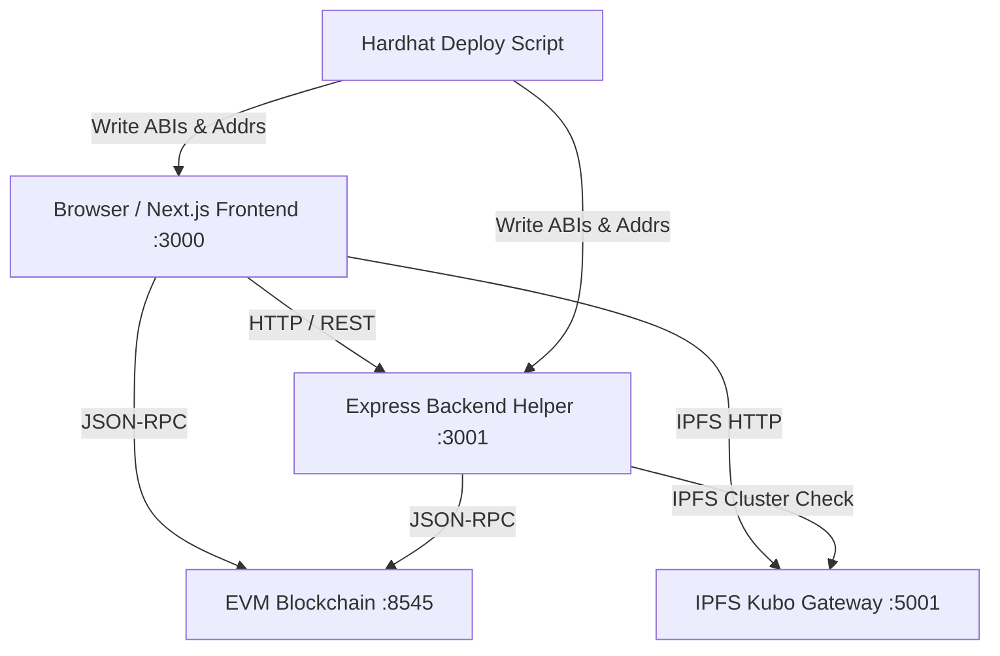

# Platform Architecture Document
**BHAROSA (भरोसा)** · Smart India Hackathon 2026 · PS SIH26125 · Team LUMINARYFORGE

---

## 1. System Overview

Bharosa is structured into three independent, decoupled projects:
1. **`frontend/`**: Next.js 14 App Router client application with in-browser WebCrypto AES-256-GCM, ECIES secp256k1 key wrapping, and SnarkJS Groth16 ZK proving.
2. **`backend/`**: Node.js 20 Express service providing SIWE authentication, gasless relayer paymaster, IPFS cluster pinning health monitor, and blockchain event indexer.
3. **`blockchain/`**: Hardhat workspace containing 6 Solidity ^0.8.24 smart contracts and Circom 2 ZK circuits.

---

## 2. Interaction Topology

The three projects communicate strictly through:
- **HTTP / REST:** `frontend/` calls `backend/` for SIWE nonce/login, gasless transaction sponsorship, IPFS health, and audit export.
- **JSON-RPC (EVM):** Both `frontend/` and `backend/` connect directly to the Ethereum / Polygon / Arbitrum RPC node (default: `http://127.0.0.1:8545`).
- **Generated Contracts:** `blockchain/scripts/deploy.ts` auto-exports ABIs and deployed addresses to `frontend/src/contracts/` and `backend/src/contracts/`.

---

## 3. Core Cryptographic Invariants

| Component | Standard | Key Invariant |
| :--- | :--- | :--- |
| **Asset Encryption** | AES-256-GCM | Plaintext never leaves browser memory. IV is 96-bit cryptographically secure random. AAD bound to `assetId:v1`. |
| **Key Delegation** | ECIES (secp256k1) | File AES key wrapped using recipient's secp256k1 public key via ephemeral ECDH + HKDF-SHA256. |
| **Verifiable Credentials** | W3C VC 1.1 + EIP-712 | Deterministic canonical subject hashing; signed via domain-separated EIP-712 typed data. |
| **Access Control** | NIST SP 800-162 ABAC | Smart contract strictly enforces `notBefore <= block.timestamp <= expiresAt` and matching `role`. |
| **Zero-Knowledge** | Circom 2 + Groth16 | BN254 curve pairing verification. Raw scores (e.g. CGPA 9.40) remain private in client memory. |
