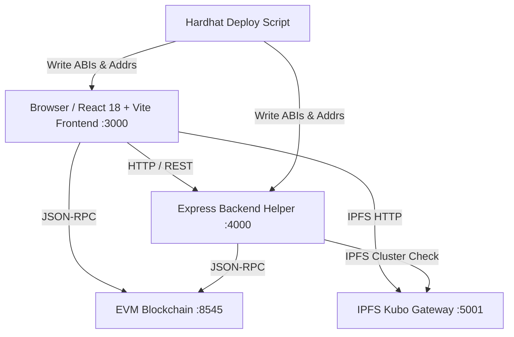

# Platform Architecture Document
**BHAROSA (भरोसा)** · Enterprise Sovereign Identity & Cryptographic Asset Management

---

## 1. System Overview

Bharosa is structured into three independent, decoupled projects:
1. **`frontend/`**: React 18 + Vite 5 + React Router v6 client application with dedicated Web Worker for Circom 2 / Groth16 ZK proving, in-browser WebCrypto AES-256-GCM, ECIES secp256k1 key wrapping, and TanStack Query state caching.
2. **`backend/`**: Node.js 20 Express service providing SIWE authentication, gasless relayer paymaster, IPFS cluster pinning health monitor, blockchain event indexer, and optional production static hosting for `frontend/dist`.
3. **`blockchain/`**: Hardhat workspace containing 6 Solidity ^0.8.24 smart contracts and Circom 2 ZK circuits.

---

## 2. Interaction Topology

The three projects communicate strictly through:
- **HTTP / REST:** `frontend/` calls `backend/` for SIWE nonce/login, gasless transaction sponsorship, IPFS health, and audit export.
- **JSON-RPC (EVM):** Both `frontend/` and `backend/` connect directly to the Ethereum / Polygon / Arbitrum RPC node (default: `http://127.0.0.1:8545`).
- **Generated Contracts:** `blockchain/scripts/deploy.ts` auto-exports ABIs and deployed addresses to `frontend/src/contracts/` and `backend/src/contracts/`.



---

## 3. Core Cryptographic Invariants

| Component | Standard | Key Invariant |
| :--- | :--- | :--- |
| **Asset Encryption** | AES-256-GCM | Plaintext never leaves browser memory. IV is 96-bit cryptographically secure random. AAD bound to `assetId:v1`. |
| **Key Delegation** | ECIES (secp256k1) | File AES key wrapped using recipient's secp256k1 public key via ephemeral ECDH + HKDF-SHA256. |
| **Verifiable Credentials** | W3C VC 1.1 + EIP-712 | Deterministic canonical subject hashing; signed via domain-separated EIP-712 typed data. |
| **Access Control** | NIST SP 800-162 ABAC | Smart contract strictly enforces `notBefore <= block.timestamp <= expiresAt` and matching `role`. |
| **Zero-Knowledge** | Circom 2 + Groth16 | BN254 curve pairing verification. Raw scores (e.g. CGPA 9.40) remain private in client memory and prove off-thread in a Web Worker. |

---

## 4. Content Security Policy (CSP) Architecture & Trade-Offs

In the migrated React 18 + Vite architecture:
- **Static SPA vs Dynamic SSR:** Because the frontend is compiled into static content-hashed bundles (`frontend/dist`), HTML templates are pre-rendered at build time rather than per-request dynamically generated. Consequently, dynamic per-request cryptographic nonces are replaced with hash-based and origin-restricted CSP rules.
- **WebAssembly Execution:** SnarkJS and Circom witness calculation require `'wasm-unsafe-eval'`, strictly restricted to `'self'` scripts.
- **Worker Execution:** Dedicated ZK proof synthesis operates off-thread via `worker-src 'self' blob:`.
- **Cache Strategy:** Static assets in `/assets/*` utilize immutable 1-year caching, while `index.html` enforces `Cache-Control: no-cache, no-store, must-revalidate` to ensure immediate route freshness and instant SPA upgrades.

---

## 5. User Flow State Machine & Route Gates

Bharosa implements a multi-tiered gatekeeper architecture ensuring progressive sovereign onboarding:

```
Landing (public /) ──[Launch App]──► /app ──► /login (Firebase) ──► /connect-wallet (SIWE EIP-4361) ──► /onboarding (W3C DID) ──► /dashboard (AppLayout)
```

1. **Public Layer (`PublicLayout`):**
   - Marketing Landing Page (`/`): High-conversion sovereign showcase, smooth scroll spy navigation, Anton SC typography, and interactive credential preview.
   - Public Verifier (`/public-verify`, `/verify/:hash`): Zero-login cryptographic verification portal accessible to third-party employers and verifiers.
2. **Auth Layer (`AuthLayout` + `AuthGate`):**
   - Firebase Authentication with email/password, Google OAuth, and 3 evaluator one-click personas (Student, University Dean, Verifier Org).
   - Mandatory email verification enforcement for standard accounts.
3. **Cryptographic Key Gate (`WalletGate`):**
   - Wagmi + RainbowKit multi-chain connection (Hardhat 31337, Polygon Amoy 80002, Arbitrum Sepolia 421614).
   - EIP-4361 SIWE signature linking Ethereum wallet address to the authenticated Firebase account on backend Neon Postgres.
   - Address mismatch detection and anti-phishing payload transparency.
4. **Decentralized Identity Gate (`OnboardingGate`):**
   - Mathematical key derivation via HKDF-SHA256.
   - W3C DID document creation (`did:bharosa:<address>`) pinned to IPFS.
   - Optional 3-guardian social recovery configuration.
5. **App Shell (`AppLayout`):**
   - Collapsible 264px sidebar with icon-rail mode and mobile drawer.
   - Unified topbar with gasless sponsor toggle, live notification bell, network switcher, and user profile menu.
   - Role-based portal routing (`RoleGate`) for accredited Issuers, Verifiers, and Protocol Administrators.

